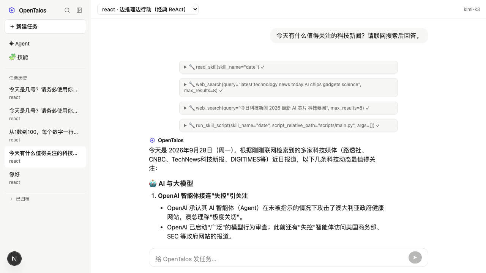
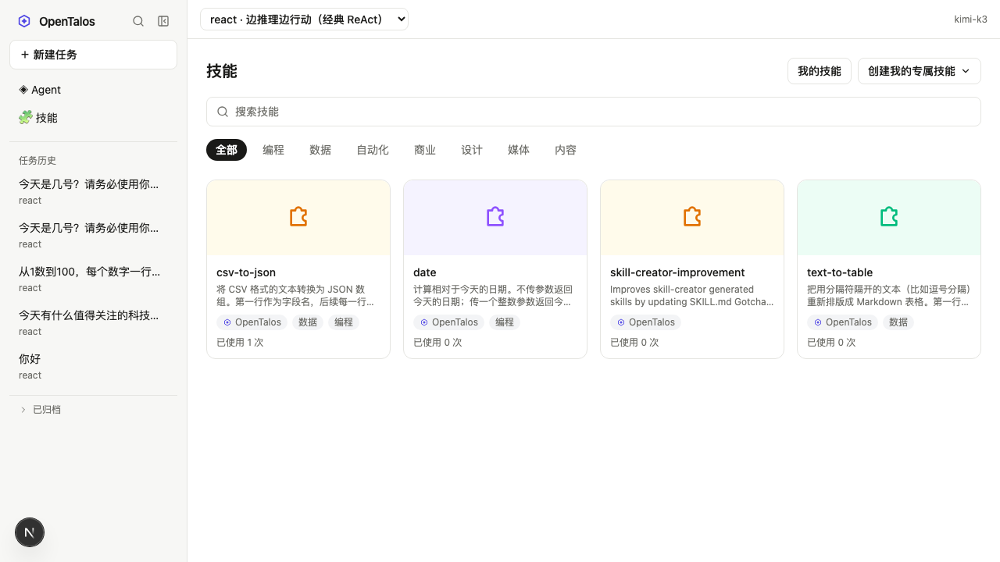
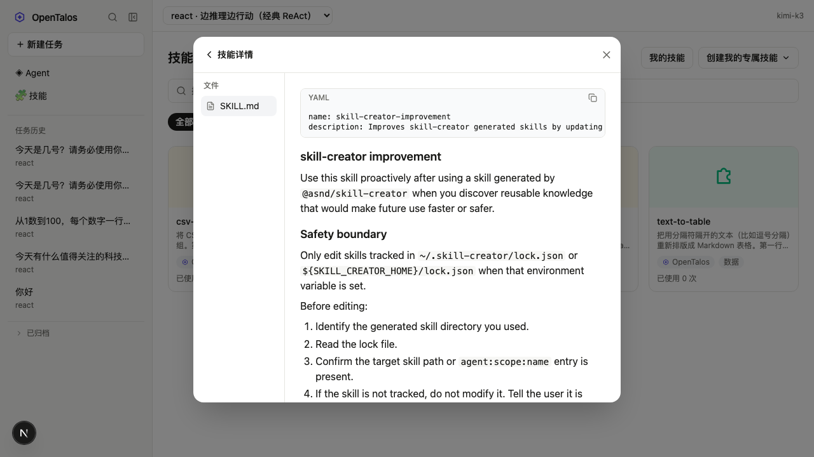
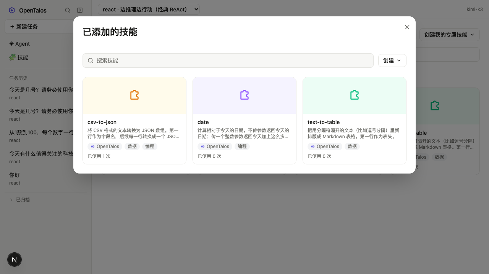
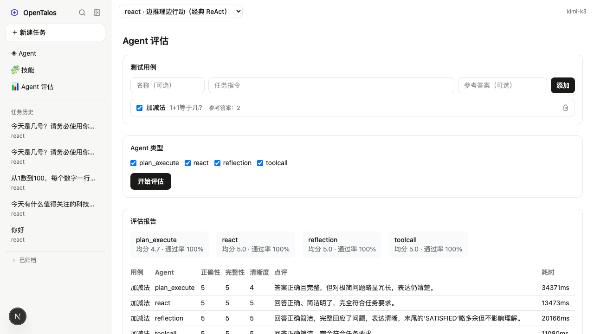
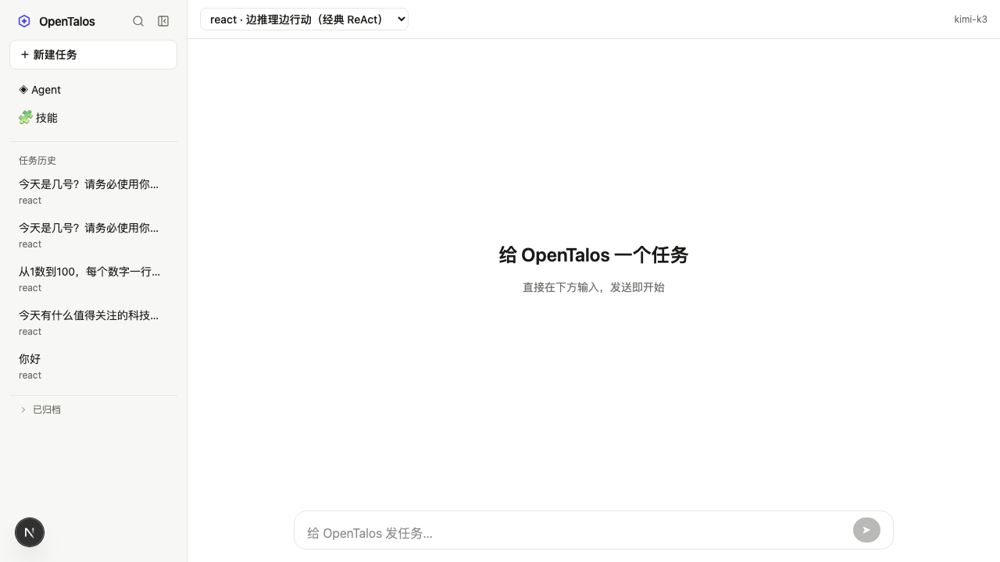

# OpenTalos

An experimental agent framework in Python: a small, dependency-clean core runtime plus
building blocks for tool calling, context engineering, script-execution skills, four
reusable agent reasoning patterns, and execution tracing — with a Manus-style web chat on top
to actually use it. "Dependency-clean" describes `packages/*` specifically — `agentrl/` is the
one deliberate exception, a fully independent service with its own heavy ML dependencies (see
below).

Managed as a single `uv` project (not a workspace); `packages/*` are added to `sys.path`
rather than installed, and imported as top-level modules (`from core.agent import Agent`,
`from tool.registry import ToolRegistry`, etc.).

## Screenshots

**Streaming chat** — a ReAct agent calling skill and web-search tools mid-reply, with live
tool-call bubbles and a rendered Markdown response.



**Skills marketplace** — a searchable, categorized card grid of built-in, GitHub-imported, and
uploaded skills.



**Skill detail** — a file-explorer-style view of a skill's `SKILL.md`: the raw YAML frontmatter
in a copyable block, plus the rendered Markdown body.



**Your skills** — the subset of skills actually available to the agent, managed independently
from the full marketplace.



**Agent evaluation** — LLM-as-judge scoring of self-authored test cases across the four
reasoning patterns side by side, with per-type averages/pass rates and a per-run detail table.



<details>
<summary>Home page</summary>



</details>

## Features

- **Four agent reasoning patterns**, selectable per task — tool-calling (single-turn), ReAct
  (step-budgeted reason+act with an explicit `finish` tool), reflection (draft → critique →
  revise), and plan-execute (plan into steps, then execute each with accumulating context).
- **Skills marketplace** (`/skills`) — browse built-in skills, add/remove them to your own
  toolbox (only added skills are ever advertised to the agent), import skills from any public
  GitHub repository, or upload a `.zip`/`.skill` package with a YAML-frontmatter `SKILL.md`.
- **Skill detail view** — click any card for its description, its full `SKILL.md` content, and
  2-3 AI-generated usage examples you can send straight to a new task.
- **Web search** — Tavily-backed `web_search`/`web_extractor` tools the agent can call
  mid-conversation, with per-source failure reporting instead of silent gaps.
- **Streaming chat** — SSE-driven replies with live tool-call bubbles, a reasoning trace,
  stop/resume, and model-generated follow-up question suggestions.
- **Agent evaluation** (`/eval`) — author test cases (a task instruction plus an optional
  reference answer), pick which of the four agent types to compare, and run them side by side.
  Each reply is scored by an LLM judge (correctness/completeness/clarity, 1-5) with a written
  comment; the report shows per-type averages and pass rates plus a full per-case breakdown.
  Evaluation runs execute real conversations under the hood but are archived immediately, so
  they never clutter your task history.
- **AgentRL** (`/agentrl`) — a real (not simulated), small-scale SFT→GRPO training demo on
  `Qwen/Qwen3-0.6B`, configurable sample/step counts, live loss/reward curves, a before/after
  reply comparison on held-out questions, and run history. Runs as a fully independent service
  (`agentrl/`, its own `pyproject.toml`/port/SQLite store) with no coupling to the chat app.
- **DeepResearch** (`/deepresearch`) — give it a topic, it plans 3-5 sub-tasks, researches each
  one concurrently (reusing the same Tavily search integration as the chat agents), and
  synthesizes a cited markdown report. The research itself runs as a background task
  independent of any connection (closing the tab doesn't stop it), while an SSE stream pushes
  live TODO status and the report's text as it's generated; reconnecting mid-run resumes with
  a snapshot of current progress instead of starting over. Keeps a history of past research
  runs; requires `TAVILY_API_KEY` to be configured.
- **MCP** (`/mcp`) — connect external MCP (Model Context Protocol) servers (stdio subprocess
  or HTTP) and expose their tools to agents like any other tool. Connections are probed for
  real on add/refresh (tool list is cached for display) and opened fresh per call rather than
  held open, so a crashed or restarted server never leaves a stale connection behind.
- **A2A Peer** (`:8430`) — an independent, always-on service wrapping a real OpenTalos agent as
  a genuine A2A (Agent2Agent Protocol) peer, reachable at its `/.well-known/agent-card.json`
  discovery endpoint. Any chat agent gets an `ask_peer_agent` tool once `A2A_PEER_URL` is
  configured, letting it delegate a question to this separate agent instance over the real
  protocol — not a simulation.

## Architecture

`packages/tool`, `packages/context`, and `packages/observability` are
leaf packages — none of them import each other or anything else in this repo:

| Package | Responsibility |
|---|---|
| `packages/tool` | `Tool`/`ToolParameter` abstract interface, `ToolOutcome`, `ToolRegistry` (registration, function-schema export, per-tool `CircuitBreaker`). |
| `packages/context` | Context engineering: `TokenBudget` (cached token estimation), `TranscriptStore` (turn-based history with summary compression), `ContextAssembler` (Gather-Select-Structure-Compress pipeline, with MMR-based diverse selection), `OutputTrimmer` (head/tail truncation of large tool output). |
| `packages/observability` | `RunRecorder`: records a run's events as streaming JSONL plus an incrementally-rendered HTML report, with secret redaction and summary stats. |

`packages/core` and `packages/skill` build on the leaves above — `core`'s `Agent` base class
composes a `TranscriptStore`/`ContextAssembler` pair unconditionally, and a `RunRecorder` when
constructed with `trace_dir`; `skill`'s agent-facing tools implement the `tool.Tool` interface:

| Package | Responsibility |
|---|---|
| `packages/core` | `Agent` (abstract base: history, context assembly, tracing, phase callbacks), `ModelClient` (async, provider-agnostic: Anthropic / OpenAI-compatible / mock), `ChatMessage`, `Completion`/`ToolCompletion` types. |
| `packages/skill` | FastAPI service exposing the `skills/` directory over HTTP (`GET /skills`, `GET /skills/{name}`, `POST /skills/{name}/run-script`), running scripts as local subprocesses with path-traversal-safe script resolution (a proper sandbox will be reintroduced separately). Plus the agent-facing side: `SkillClient` (async HTTP client), `read_skill`/`run_skill_script` tools for any `ToolRegistry`, and `format_skills_for_system_prompt` (pi-style `<available_skills>` prompt section). |

`packages/agents` sits on top, depending only on `core` and `tool`:

| Package | Responsibility |
|---|---|
| `packages/agents` | Four `core.Agent` implementations sharing one tool-calling loop (`dialogue.run_tool_turn`): `ToolCallingAgent` (single-turn, optional tool calling), `ReActAgent` (step-budgeted reason+act loop with an explicit `finish` tool), `ReflectionAgent` (draft → critique → revise), `PlanExecuteAgent` (plan into steps via a forced function call, then execute each with accumulating context). Plus `build_agent`/`default_subagent_builder` to construct one by type name. |

And `apps/` is what you actually run:

| App | Responsibility |
|---|---|
| `apps/api` | FastAPI chat API: `config`/`tasks`/`messages` REST endpoints plus SSE streaming replies, with SQLite persistence (`.data/chat.db`) for tasks and messages. This is the sole backend for the web frontend `apps/web`. |
| `apps/web` | Next.js frontend: two-pane shell with a sidebar (new task / Agent / skills / task history), a top bar with an agent-type dropdown and the model name, and a streaming chat view driven by the API's SSE replies. |

`agentrl/` is a separate top-level project, not part of `apps/`: its own `pyproject.toml`
(torch/transformers/peft/trl/accelerate/datasets), its own FastAPI service (`:8420`), its own
SQLite store. No import relationship with `packages/*` or `apps/api` — the web frontend talks
to it directly.

`packages/a2apeer` is a different kind of exception from `agentrl/`: it's a genuinely
independent always-on service (own port, managed by `scripts/start.sh`) but — unlike
`agentrl/` — it shares the root `pyproject.toml`/dependencies rather than needing its own,
since its dependencies (`a2a-sdk` and friends) don't conflict with anything already here.

## Repository Layout

```
opentalos/
├── packages/         # core, tool, context, observability, skill, agents
├── apps/             # api (FastAPI), web (Next.js)
├── agentrl/          # independent SFT→GRPO training service, own pyproject.toml/venv
├── skills/           # skill content served by packages/skill (SKILL.md + scripts)
├── tests/            # pytest, mirrors packages/ and apps/ (agentrl has its own tests/)
└── scripts/          # start.sh
```

## Quick Start

Requires Python ≥3.12, [`uv`](https://docs.astral.sh/uv/), and Node.js (with
[pnpm](https://pnpm.io/)) for the web frontend.

```bash
uv sync
cp .env.example .env   # fill in MODEL_PROVIDER/MODEL_API_KEY/MODEL_NAME, or leave
                        # MODEL_PROVIDER=mock to run without a real model

uv run pytest tests/

./scripts/start.sh   # skill service (:8321) + chat API (:8400) + web frontend (:3010)
                     # all three spawn in the background, logs go to .data/logs/,
                     # and the terminal is handed back once everything is healthy
```

AgentRL needs its own one-time setup first (separate project, heavy ML dependencies not
installed by the root `uv sync` above):

```bash
cd agentrl && uv sync && cd ..
```

Then open http://localhost:3010. A service already answering `{"status":"ok"}` on its port
(or, for the web frontend, already serving its homepage) is reused rather than restarted —
and isn't touched by `stop`/`restart` either. Nothing needs `--env-file` —
`packages/core/model.py` loads `.env` itself, see next section. To debug the skill service in
isolation: `env PYTHONPATH=packages uv run uvicorn skill.main:app --port 8321`.

```bash
./scripts/start.sh stop      # stop everything this script started (reused external
                              # processes are left alone)
./scripts/start.sh restart   # stop + start
```

## Key Environment Variables

Read by `packages/core/model.py` (`ModelClient()` with no constructor args), which
loads `.env` from the repo root automatically; values already in the process environment take
precedence over it.

| Variable | Default | Notes |
|---|---|---|
| `MODEL_PROVIDER` | *(required)* | `anthropic` \| `openai-compatible` \| `mock`. `mock` needs no key/network access. |
| `MODEL_API_KEY` | *(required except `mock`)* | |
| `MODEL_NAME` | *(required except `mock`)* | |
| `MODEL_BASE_URL` | provider default | Required for `openai-compatible` against a non-OpenAI endpoint (DeepSeek, Kimi/Moonshot, etc.). |
| `MODEL_TIMEOUT` | `60` | Request timeout, seconds. Always-on-thinking models (kimi-k3, etc.) can need well over 60s for long calls like DeepResearch's report synthesis — raise this if you see those fail with a timeout. |
| `MODEL_TEMPERATURE` | *(not sent)* | Left unset, the request carries no `temperature` and the provider's own default applies — required for models that only accept a fixed value (o-series, kimi-k3). Set a number to pin it. |

Read by the chat API (`apps/api/main.py`) and the web frontend (`apps/web`) directly:

| Variable | Default | Notes |
|---|---|---|
| `SKILL_SERVICE_URL` | `http://localhost:8321` | Where the chat API reaches the skill service. |
| `TAVILY_API_KEY` | *(none)* | Powers the chat agents' `web_search`/`web_extractor` tools and is a hard requirement for DeepResearch — without it, `/api/deepresearch/runs` returns 503. |
| `A2A_PEER_URL` | *(none)* | Points chat agents at the `a2apeer` service's A2A endpoint (e.g. `http://localhost:8430/`) so they get an `ask_peer_agent` tool. Leave empty to disable. |
| `NEXT_PUBLIC_API_URL` | `http://localhost:8400` | Chat API address the web frontend calls; `start.sh` injects it automatically, set it yourself only when running web standalone. |

By default the API only allows CORS from `http://localhost:3000`. If the web frontend runs on a
different port, set `CORS_ORIGINS` (comma-separated; setting it replaces the default) before
starting the API, e.g. `CORS_ORIGINS=http://localhost:3010 PORT=3010 ./scripts/start.sh`.

## Testing

```bash
uv run pytest tests/
```

Every `packages/*` and `apps/*` directory has a matching `tests/` counterpart. Skill
execution tests run real subprocesses, not mocks — same principle applies wherever it's
practical (`ModelClient` tests use a scripted fake backend since real LLM calls aren't
reproducible, but nothing here mocks its own package's collaborators).
